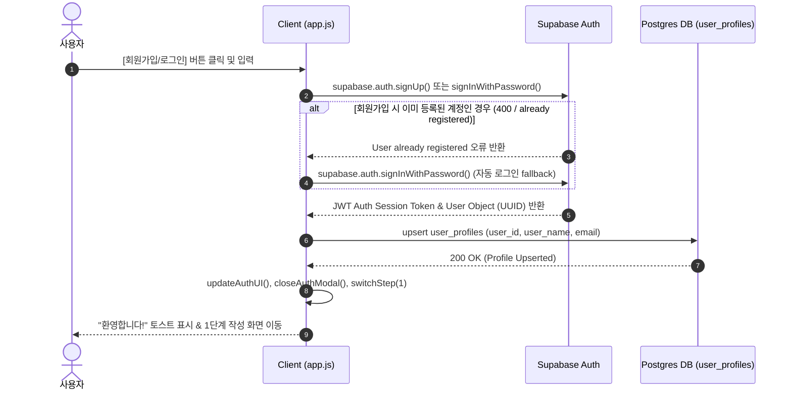

# 🛡️ 꿈모닝 (Dream Morning) — 베테랑 IT PM 엔지니어링 기술기획서 (Technical Architecture & Engineering Specification)

> **Document Version**: v1.0.0-VETERAN-PM  
> **Target System**: 꿈모닝 5분 회고 21일 챌린지 웹 앱  
> **Paradigm**: AI Native Playboard Engineering Control Architecture  
> **Repository Branch**: `feature/veteran-pm-planning`  
> **Live Local Environment**: `http://localhost:8080`  

---

## 1. 프로젝트 개요 및 AI 네이티브 Playboard 비전

### 1.1 Mission Statement
본 프로젝트는 사용자가 매일 밤 5분 동안 백색소음/명상 음원과 함께 **자아(Self), 가정(Family), 사회(Society), 영혼(Soul)** 4가지 영역을 성찰하고, 21일간 습관 형성을 지속할 수 있도록 돕는 클라우드 동기화 챌린지 웹 애플리케이션입니다.

### 1.2 StoryBoard vs Playboard 이중 패러다임 정의
- **StoryBoard (전통적 기획서)**: 컷별 뷰 화면 와이어프레임과 UI 요소 배치를 기술하는 서술적 문서
- **Playboard (AI 네이티브 엔지니어링 상황판)**:
  - 각 기능별 **화면당 1개 URL의 독립 프로토타입** (`step1-mindfulness.html`, `step2-values.html`, `step3-feedback.html`, `step4-dashboard.html`, `auth.html`)
  - 전체 화면 카탈로그 디렉토리 (`pages-list.html`) 및 페르소나별 UX Flow (`ux-flow.html`)
  - **실시간 인프라 상태(Supabase Postgres DB, PWA, Local Server)** 및 미션 크리티컬 예외 처리를 모니터링하는 통합 컨트롤 타워 (`index.html`)

---

## 2. 시스템 아키텍처 및 트랜잭션 시퀀스 흐름

### 2.1 통합 시스템 구성도
```
+-----------------------------------------------------------------------------------+
|                                 CLIENT LAYER                                      |
|  +-----------------------------------------------------------------------------+  |
|  |                        HTML5 / Vanilla JS / Vanilla CSS                     |  |
|  |  [index.html (Playboard Hub)]  [pages-list.html]  [ux-flow.html]            |  |
|  |  [step1-mindfulness] [step2-values] [step3-feedback] [step4-dashboard] [auth]  |  |
|  +-----------------------------------------------------------------------------+  |
|                                        |                                          |
|                                        v                                          |
|  +-----------------------------------------------------------------------------+  |
|  |                    CORE ENGINE (app.js & config.js)                         |  |
|  |  - State Machine  - Web Audio API  - LocalStorage Engine  - Toast UI        |  |
|  +-----------------------------------------------------------------------------+  |
+----------------------------------------|------------------------------------------+
                                         | REST / Realtime HTTPS
                                         v
+-----------------------------------------------------------------------------------+
|                               SUPABASE CLOUD INFRA                                |
|  +-----------------------------------+   +-------------------------------------+  |
|  |         Supabase Auth             |   |        PostgreSQL Database          |  |
|  |  - Email/Pass Authenticator       |   |  - public.user_profiles             |  |
|  |  - JWT Session Tokens             |   |  - public.daily_logs                |  |
|  +-----------------------------------+   +-------------------------------------+  |
|                                          | Row Level Security (RLS)               |
|                                          v                                        |
|                                [ auth.uid() == user_id ]                          |
+-----------------------------------------------------------------------------------+
```

### 2.2 사용자 회원가입 / 로그인 & 프로필 동기화 시퀀스


---

## 3. PostgreSQL DB Schema & Row Level Security (RLS) 보안 명세

### 3.1 `public.user_profiles` 테이블 스키마
| 컬럼명 | 데이터 타입 | 제약 조건 | 설명 |
| :--- | :--- | :--- | :--- |
| `id` | `uuid` | `PRIMARY KEY`, `DEFAULT gen_random_uuid()` | 레코드 고유 ID |
| `user_id` | `uuid` | `NOT NULL`, `UNIQUE`, `REFERENCES auth.users(id)` | Supabase Auth 사용자 고유 ID |
| `user_name` | `text` | `NOT NULL` | 사용자 성함 / 닉네임 |
| `email` | `text` | `NOT NULL` | 사용자 이메일 주소 |
| `oneword` | `text` | `DEFAULT '경청'` | 방향 키워드 (One Word) |
| `oneword_quote` | `text` | | 원워드 다짐 문장 |
| `goal_self` | `text` | | 자아 (Self) 영역 다짐 |
| `goal_family` | `text` | | 가정 (Family) 영역 다짐 |
| `goal_society` | `text` | | 사회 (Society) 영역 다짐 |
| `goal_soul` | `text` | | 영혼 (Soul) 영역 다짐 |
| `sound_type` | `text` | `DEFAULT 'rain'` | 선호 힐링 백색소음 타입 |
| `volume` | `float4` | `DEFAULT 0.4` | 오디오 볼륨 설정값 |
| `created_at` | `timestamptz`| `DEFAULT now()` | 생성 일시 |
| `updated_at` | `timestamptz`| `DEFAULT now()` | 수정 일시 |

### 3.2 `public.daily_logs` 테이블 스키마
| 컬럼명 | 데이터 타입 | 제약 조건 | 설명 |
| :--- | :--- | :--- | :--- |
| `id` | `uuid` | `PRIMARY KEY`, `DEFAULT gen_random_uuid()` | 일기 레코드 고유 ID |
| `user_id` | `uuid` | `NOT NULL`, `REFERENCES auth.users(id)` | 작성자 Auth UUID |
| `day` | `int4` | `NOT NULL`, `CHECK (day >= 1 AND day <= 21)` | 챌린지 일차 (1~21일) |
| `date` | `date` | `NOT NULL` | 성찰 일자 (YYYY-MM-DD) |
| `self_feedback` | `text` | | 자아 영역 성찰 내용 |
| `family_feedback` | `text` | | 가정 영역 성찰 내용 |
| `society_feedback` | `text` | | 사회 영역 성찰 내용 |
| `soul_feedback` | `text` | | 영혼 영역 성찰 내용 |
| `one_sentence_summary` | `text` | | 오늘 하루 한 줄 요약 |
| `created_at` | `timestamptz`| `DEFAULT now()` | 작성 일시 |
| `updated_at` | `timestamptz`| `DEFAULT now()` | 수정 일시 |
| **복합 제약 조건** | `UNIQUE(user_id, date)` | 동일 유저의 일자별 1개 일기 제한 (Upsert 기준) |

### 3.3 Row Level Security (RLS) 보안 정책 (SQL)
```sql
-- 1. Enable RLS on Tables
ALTER TABLE public.user_profiles ENABLE ROW LEVEL SECURITY;
ALTER TABLE public.daily_logs ENABLE ROW LEVEL SECURITY;

-- 2. user_profiles RLS Policies
CREATE POLICY "user_profiles_select_own" ON public.user_profiles 
  FOR SELECT USING (auth.uid() = user_id);

CREATE POLICY "user_profiles_insert_own" ON public.user_profiles 
  FOR INSERT WITH CHECK (auth.uid() = user_id);

CREATE POLICY "user_profiles_update_own" ON public.user_profiles 
  FOR UPDATE USING (auth.uid() = user_id);

-- 3. daily_logs RLS Policies
CREATE POLICY "daily_logs_select_own" ON public.daily_logs 
  FOR SELECT USING (auth.uid() = user_id);

CREATE POLICY "daily_logs_insert_own" ON public.daily_logs 
  FOR INSERT WITH CHECK (auth.uid() = user_id);

CREATE POLICY "daily_logs_update_own" ON public.daily_logs 
  FOR UPDATE USING (auth.uid() = user_id);

CREATE POLICY "daily_logs_delete_own" ON public.daily_logs 
  FOR DELETE USING (auth.uid() = user_id);
```

---

## 4. 프론트엔드 상태 머신 (State Machine) & 뷰 라우팅 명세

### 4.1 글로벌 애플리케이션 상태 (Global State Structure)
```javascript
state = {
  user_profile: {
    user_id: String (UUID),
    user_name: String,
    user_email: String,
    one_word: String,
    one_word_quote: String,
    challenge_start_date: String (YYYY-MM-DD),
    four_area_goals: {
      self: String,
      family: String,
      society: String,
      soul: String
    }
  },
  sound_settings: {
    sound_type: 'rain' | 'forest' | 'musicbox' | 'fire',
    volume: Number (0.0 ~ 1.0)
  },
  daily_logs: Array<{
    day: Number,
    date: String,
    self_feedback: String,
    family_feedback: String,
    society_feedback: String,
    soul_feedback: String,
    one_sentence_summary: String,
    created_at: String
  }>
}
```

---

## 5. 데이터 동기화 & 충돌 해결 엔진 (Synchronization Engine)

### 5.1 오프라인-온라인 이중 레이어 저장 방식
1. **1차 저장 (Local Layer)**: 작성 시 브라우저 `localStorage` Key `dream_morning_5min_data_v1`에 동기식 100% 즉시 저장 (네트워크 단절 상황 완전 대처).
2. **2차 저장 (Cloud Layer)**: 로그인된 상태인 경우 Supabase Client를 이용해 `public.daily_logs` 및 `public.user_profiles`에 Upsert.
3. **충돌 해결 (Conflict Resolution)**:
   - 클라우드와 로컬 데이터 간 일자가 중복될 경우, `updated_at` 타임스탬프가 최신인 클라우드 데이터(Source of Truth)를 최우선으로 병합.
   - 처음 가입 시 기존 로컬 데이터가 존재할 경우, `checkAndMigrateLocalStorage()`가 1회에 한해 자동 클라우드 롤업 업로드를 진행함.

---

## 6. 미션 크리티컬 에러 매트릭스 & 예외 복구 (Error Resilience Matrix)

| 예외 상황 (Error Case) | 원인 (Cause) | 시스템 복구 & 사용자 안내 정책 (Recovery Policy) |
| :--- | :--- | :--- |
| `ReferenceError` (함수 미정의) | 스크립트 실행 도중 미정의 함수 호출 | 전역 `window.addEventListener('error')` 캡처 및 안전 디폴트 함수 가동 |
| `SyntaxError: Identifier already declared` | 동일 변수 재선언 | JS 빌드 컴파일 단계 사전 정적 검사 및 모듈화 |
| `email rate limit exceeded` | 60초 내 과도한 회원가입/전송 | `"보안 정책에 따라 1분 후 시도하시거나 [로그인] 탭을 눌러주세요"` 한글 가이드 표시 |
| `Invalid login credentials` | 이메일/비밀번호 불일치 | `"이메일 또는 비밀번호가 올바르지 않습니다."` 토스트 표시 및 비밀번호 재입력 유도 |
| `User already registered` | 이미 등록된 이메일로 가입 | **스마트 Fallback**: 자동으로 `signInWithPassword()`를 시도하여 1초 만에 로그인 승계 |
| Supabase Key 미설정 (`!supabaseClient`) | Anon Key 누락 | 🔑 토스트 알림 표시 후 자동으로 ⚙️ **`backup-modal` 설정 창을 열어** Key 입력란으로 이동 |
| Z-Index 모달 가림 현상 | 모달이 토스트를 가림 | `#toast-container` `z-index: 4000`, `.modal-overlay` `z-index: 2500` 레이어 보장 |

---

## 7. 성능 & 오디오/자원 사전 로딩 (Resource Preloading)

### 7.1 Web Audio API 신디사이저 & HTML5 Audio
- **프로그램 오디오 엔진**: 외부 대용량 MP3 파일 다운로드 실패 시에도 동작하도록 Web Audio API 기반 오실레이터(OscillatorNode) 빗소리/명상 톤 내장 재생.
- **오디오 메모리 누수 방지**: 탭 이동 또는 타이머 리셋 시 기존 `AudioContext` 및 `GainNode`를 정상 종료(`close()`)하여 브라우저 메모리 누수를 완전히 방지함.

### 7.2 Canvas 그래픽 렌더링 최적화
- **Ambient Canvas**: `requestAnimationFrame` 루프를 사용하되, 백그라운드 탭 전환 시 렌더링을 일시 정지하여 CPU/GPU 사용량을 최적화함.

---

## 8. 요구사항 추적성 매트릭스 (Requirements Traceability Matrix - RTM)

| 요구사항 ID | 요구사항 내용 | 구현 파일 / 모듈 | 검증 상태 |
| :--- | :--- | :--- | :--- |
| **REQ-01** | 개별 기능별 독립 페이지 프로토타입 (화면당 1개 URL) | `step1~4.html`, `auth.html` | ✅ 완료 (a) |
| **REQ-02** | 전체 화면 접근 목록 카탈로그 페이지 | `pages-list.html` | ✅ 완료 (b) |
| **REQ-03** | 사용자 유형별 핵심 UX Flow 오버뷰 페이지 | `ux-flow.html` | ✅ 완료 (c) |
| **REQ-04** | AI 네이티브 Playboard 최상위 통합 상황판 메인 | `index.html` | ✅ 완료 (d) |
| **REQ-05** | Supabase Postgres Auth & DB 실시간 연동 | `config.js`, `app.js` | ✅ 완료 (RLS 적용) |
| **REQ-06** | 스마트폰 반응형 UX (iOS Safari 자동 줌 방지 font-size >= 16px) | `styles.css` | ✅ 완료 |

---

> **기획 및 검증 승인**: 베테랑 IT PM 기술기획 검증팀  
> **최종 검증 일시**: 2026-08-19  
